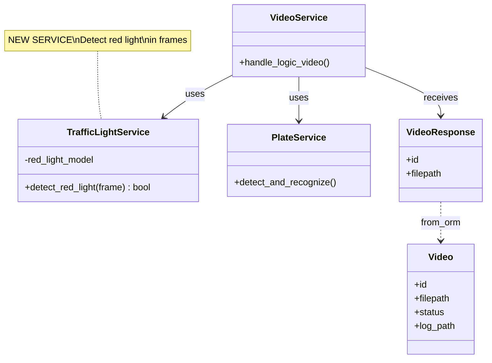
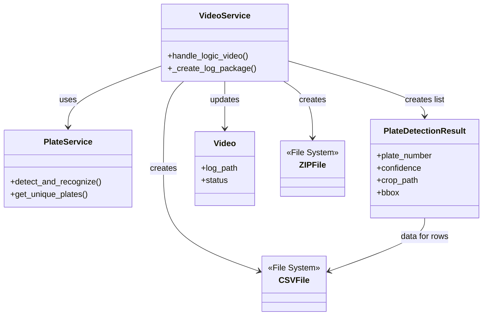
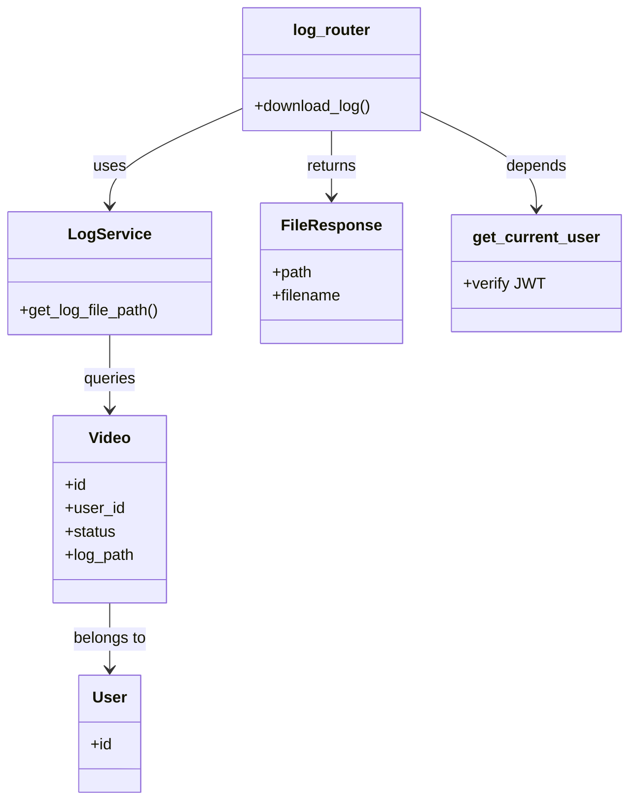

# PHÂN TÍCH CÁC LỚP THỰC THỂ (ENTITY CLASSES)

## 3 Chức Năng: DETECT RED LIGHT, TẠO FILE LOG, DOWNLOAD FILE LOG

---

## 📚 MỤC LỤC
1. [Tổng Quan](#1-tổng-quan)
2. [Phân Loại Lớp Thực Thể](#2-phân-loại-lớp-thực-thể)
3. [Chi Tiết Từng Lớp](#3-chi-tiết-từng-lớp)
4. [Ma Trận Chức Năng - Lớp](#4-ma-trận-chức-năng---lớp)
5. [Sơ Đồ Quan Hệ](#5-sơ-đồ-quan-hệ)

---

## 1. TỔNG QUAN

### 1.1. Định Nghĩa Lớp Thực Thể
**Lớp thực thể (Entity Class)** là các class đại diện cho:
- Domain objects (ORM Models)
- Data Transfer Objects (DTOs/Schemas)
- Service classes (Business Logic)
- Value objects (Data structures)

### 1.2. Phạm Vi Phân Tích
Phân tích các lớp liên quan đến 3 chức năng chính:
1. ✅ **DETECT_RED_LIGHT** - Phát hiện đèn đỏ
2. ✅ **TẠO_FILE_LOG** - Tạo package log (CSV + ZIP)
3. ✅ **DOWNLOAD_FILE_LOG** - Tải xuống file log

---

## 2. PHÂN LOẠI LỚP THỰC THỂ

### 2.1. Theo Vai Trò (Role-Based Classification)

```
📦 ENTITY CLASSES
├── 🗄️ DOMAIN ENTITIES (ORM Models)
│   ├── User
│   ├── Video ⭐⭐⭐
│   └── Violation
│
├── 📄 DATA TRANSFER OBJECTS (DTOs)
│   ├── VideoResponse ⭐⭐
│   ├── PlateDetectionResult ⭐⭐
│   ├── VideoUploadResponse
│   ├── UserResponse
│   └── LoginResponse
│
├── 🔧 SERVICE ENTITIES (Business Logic)
│   ├── TrafficLightService ⭐⭐⭐ (NEW)
│   ├── VideoService ⭐⭐⭐
│   ├── PlateService ⭐⭐
│   ├── LogService ⭐⭐⭐
│   └── AuthService ⭐
│
├── 🌐 ROUTER ENTITIES (Controllers)
│   ├── video_router ⭐⭐
│   └── log_router ⭐⭐
│
└── 🔐 MIDDLEWARE ENTITIES
    └── get_current_user ⭐
```

### 2.2. Theo Chức Năng (Function-Based Classification)

| Chức Năng | Domain | DTO | Service | Router | Middleware |
|-----------|--------|-----|---------|--------|------------|
| **DETECT_RED_LIGHT** | Video | VideoResponse, PlateDetectionResult | TrafficLightService ⭐, VideoService, PlateService | video_router | get_current_user |
| **TẠO_FILE_LOG** | Video | VideoResponse, PlateDetectionResult, VideoUploadResponse | VideoService ⭐, PlateService | video_router | get_current_user |
| **DOWNLOAD_FILE_LOG** | Video, User | VideoResponse | LogService ⭐, AuthService | log_router ⭐ | get_current_user |

---

## 3. CHI TIẾT TỪNG LỚP

---

## 📦 3.1. DOMAIN ENTITIES (ORM Models)

### **Class: User**

**File:** `app/models/models.py`  
**Kế thừa:** SQLAlchemy `Base`  
**Table:** `users`

```python
class User(Base):
    __tablename__ = "users"
```

#### **Thuộc Tính (Attributes):**

| Tên | Kiểu | Ràng Buộc | Mô Tả |
|-----|------|-----------|-------|
| `id` | Integer | PK, Auto Increment | ID người dùng |
| `username` | String(255) | Unique, NOT NULL | Tên đăng nhập |
| `password_hash` | String(255) | NOT NULL | Mật khẩu đã hash |
| `created_at` | DateTime | Default: now() | Thời gian tạo |

#### **Quan Hệ (Relationships):**

| Tên | Loại | Target | Mô Tả |
|-----|------|--------|-------|
| `videos` | One-to-Many | Video | 1 User có nhiều Videos |

#### **Phương Thức (Methods):**
- Không có custom methods (sử dụng SQLAlchemy defaults)

#### **Vai Trò Trong Các Chức Năng:**

**DETECT_RED_LIGHT:**
- ❌ Không trực tiếp tham gia
- ℹ️ Gián tiếp qua relationship với Video

**TẠO_FILE_LOG:**
- ❌ Không trực tiếp tham gia
- ℹ️ Gián tiếp qua Video.user_id

**DOWNLOAD_FILE_LOG:**
- ✅ **Validation ownership**
  ```python
  # LogService kiểm tra:
  video = db.query(Video).filter(
      Video.id == video_id,
      Video.user_id == user_id  # ← Từ User
  ).first()
  ```

---

### **Class: Video** ⭐⭐⭐ **CORE ENTITY**

**File:** `app/models/models.py`  
**Kế thừa:** SQLAlchemy `Base`  
**Table:** `videos`

```python
class Video(Base):
    __tablename__ = "videos"
```

#### **Thuộc Tính (Attributes):**

| Tên | Kiểu | Ràng Buộc | Default | Mô Tả |
|-----|------|-----------|---------|-------|
| `id` | Integer | PK, Auto Inc | - | ID video |
| `user_id` | Integer | FK→users, NOT NULL | - | ID người upload |
| `filename` | String(255) | NOT NULL | - | Tên file gốc |
| `filepath` | String(255) | NOT NULL | - | Đường dẫn file video |
| `status` | String(50) | - | "processing" | Trạng thái xử lý |
| `log_path` | String(255) | Nullable | NULL | 🔑 Đường dẫn file log ZIP |
| `created_at` | DateTime | - | now() | Thời gian tạo |

#### **Status Values:**
```python
STATUS_PROCESSING = "processing"  # Đang xử lý
STATUS_COMPLETED = "completed"    # Hoàn thành
STATUS_FAILED = "failed"          # Thất bại
STATUS_PENDING = "pending"        # Chờ xử lý
```

#### **Quan Hệ (Relationships):**

| Tên | Loại | Target | Back Populates | Mô Tả |
|-----|------|--------|----------------|-------|
| `user` | Many-to-One | User | videos | Thuộc về 1 User |
| `violations` | One-to-Many | Violation | video | Có nhiều Violations |

#### **Phương Thức (Methods):**
- Không có custom methods

#### **Vai Trò Trong Các Chức Năng:**

**DETECT_RED_LIGHT:**
```python
# VideoService.handle_logic_video()
def handle_logic_video(self, db, video_record: VideoResponse, file):
    # Đọc:
    - video_record.filepath  # Đường dẫn để đọc video
    - video_record.id        # ID để tracking
    
    # Xử lý:
    traffic_light_service.detect_red_light(frame)
    # → Set is_red_light_detected = True/False
```

**TẠO_FILE_LOG:**
```python
# Đọc (Input):
- video_record.id        # Tạo tên log: log_{id}_{uuid}.zip
- video_record.filepath  # Đọc video để detect plates

# Ghi (Output):
- video.log_path = "app/upload/logs/log_1_abc.zip"  # ⭐ CẬP NHẬT
- video.status = "completed"                        # ⭐ CẬP NHẬT
db.commit()

# State Transition:
Before: {status: "processing", log_path: NULL}
After:  {status: "completed", log_path: "path/to/log.zip"}
```

**DOWNLOAD_FILE_LOG:**
```python
# LogService.get_log_file_path()
video = db.query(Video).filter(
    Video.id == video_id,
    Video.user_id == user_id
).first()

# Đọc:
- video.id           # Validate existence
- video.user_id      # Validate ownership
- video.status       # Must be "completed"
- video.log_path     # Return cho FileResponse

# Validation Flow:
1. video exists? → 404 if not
2. video.status == "completed"? → 400 if not
3. video.log_path != NULL? → 404 if NULL
4. os.path.exists(video.log_path)? → 404 if not
5. Return video.log_path
```

#### **Lifecycle Diagram:**

```
┌─────────────────────┐
│   INITIAL STATE     │
│  (After Upload)     │
├─────────────────────┤
│ status: processing  │
│ log_path: NULL      │
└──────────┬──────────┘
           │
           │ 🔴 DETECT_RED_LIGHT
           │ 📊 TẠO_FILE_LOG
           ▼
┌─────────────────────┐
│  PROCESSING STATE   │
│  (During Process)   │
├─────────────────────┤
│ - Extract frames    │
│ - Detect red light  │
│ - Detect plates     │
│ - Create CSV        │
│ - Create ZIP        │
└──────────┬──────────┘
           │
           │ Log created
           ▼
┌─────────────────────┐
│   FINAL STATE       │
│  (Ready Download)   │
├─────────────────────┤
│ status: completed   │
│ log_path: path.zip  │ ← 📥 DOWNLOAD_FILE_LOG
└─────────────────────┘
```

---

### **Class: Violation**

**File:** `app/models/models.py`  
**Kế thừa:** SQLAlchemy `Base`  
**Table:** `violations`

```python
class Violation(Base):
    __tablename__ = "violations"
```

#### **Thuộc Tính:**

| Tên | Kiểu | Ràng Buộc | Mô Tả |
|-----|------|-----------|-------|
| `id` | Integer | PK | ID vi phạm |
| `video_id` | Integer | FK→videos | ID video |
| `plate_number` | String(50) | - | Biển số xe |
| `timestamp_frame` | String(50) | - | Timestamp frame |
| `snapshot_path` | String(255) | - | Đường dẫn ảnh |
| `created_at` | DateTime | Default: now() | Thời gian tạo |

#### **Quan Hệ:**

| Tên | Loại | Target |
|-----|------|--------|
| `video` | Many-to-One | Video |

#### **Vai Trò:**
- ❌ Không tham gia trực tiếp vào 3 chức năng
- ℹ️ Có thể mở rộng để lưu detected plates vào DB

---

## 📄 3.2. DATA TRANSFER OBJECTS (DTOs/Schemas)

### **Class: VideoResponse** ⭐⭐

**File:** `app/schemas/schemas.py`  
**Kế thừa:** Pydantic `BaseModel` (qua `VideoBase`)  
**Mục đích:** Response object chứa thông tin video

```python
class VideoBase(BaseModel):
    filename: str
    filepath: str
    status: Optional[str] = "processing"

class VideoResponse(VideoBase):
    id: int
    created_at: datetime
    
    class Config:
        from_attributes = True  # Convert từ ORM
```

#### **Thuộc Tính:**

| Tên | Kiểu | Optional | Default | Nguồn |
|-----|------|----------|---------|-------|
| `filename` | str | No | - | Inherited |
| `filepath` | str | No | - | Inherited |
| `status` | str | Yes | "processing" | Inherited |
| `id` | int | No | - | Own |
| `created_at` | datetime | No | - | Own |

#### **Phương Thức:**

```python
# Pydantic auto-generates:
@classmethod
def from_orm(cls, obj: Video) -> VideoResponse:
    """Convert ORM Video object to VideoResponse"""
```

#### **Vai Trò Trong Các Chức Năng:**

**DETECT_RED_LIGHT:**
```python
def handle_logic_video(
    self, 
    db: Session, 
    video_record: VideoResponse,  # ← INPUT DTO
    file: UploadFile
):
    # Sử dụng:
    file_path = video_record.filepath  # Đọc video
    video_id = video_record.id         # Tracking
```

**TẠO_FILE_LOG:**
```python
# Input parameter:
def _create_log_package(
    self,
    video_record: VideoResponse,  # ← INPUT
    plate_results: List[PlateDetectionResult],
    db: Session
):
    # Sử dụng:
    log_name = f"log_{video_record.id}_{uuid}"

# Output:
return VideoUploadResponse(
    video=video_record,  # ← OUTPUT (updated)
    detected_plates=[...]
)
```

**DOWNLOAD_FILE_LOG:**
```python
# Không trực tiếp sử dụng
# Nhưng có thể trả về trong response:
return List[VideoResponse]  # GET /videos/ endpoint
```

#### **Conversion Flow:**

```
Video (ORM)
    ↓ from_orm()
VideoResponse (DTO)
    ↓ Used in
Services, Routers
    ↓ JSON serialization
HTTP Response
```

---

### **Class: PlateDetectionResult** ⭐⭐

**File:** `app/schemas/schemas.py`  
**Kế thừa:** Pydantic `BaseModel`  
**Mục đích:** Đại diện cho 1 biển số phát hiện được

```python
class PlateDetectionResult(BaseModel):
    plate_number: str
    confidence: float
    crop_path: str
    bbox: list
    timestamp: Optional[float] = None
    frame_number: Optional[int] = None
```

#### **Thuộc Tính:**

| Tên | Kiểu | Optional | Example | Mô Tả |
|-----|------|----------|---------|-------|
| `plate_number` | str | No | "30A-12345" | Biển số xe |
| `confidence` | float | No | 0.95 | Độ tin cậy (0-1) |
| `crop_path` | str | No | "app/upload/crops/uuid.jpg" | Đường dẫn ảnh crop |
| `bbox` | list | No | [100,200,300,400] | Bounding box [x1,y1,x2,y2] |
| `timestamp` | float | Yes | 2.5 | Thời điểm (giây) |
| `frame_number` | int | Yes | 1 | Số thứ tự frame |

#### **Vai Trò Trong Các Chức Năng:**

**DETECT_RED_LIGHT:**
```python
# Không trực tiếp liên quan
# Nhưng plates được detect cùng lúc với red light

# Trong handle_logic_video():
for frame in video:
    # 1. Detect red light
    has_red_light = traffic_light_service.detect_red_light(frame)
    
    # 2. Detect plates
    plates = plate_service.detect_and_recognize(frame)
    # plates là List[Dict] → Convert to PlateDetectionResult
```

**TẠO_FILE_LOG:**
```python
# Core data structure cho CSV

def _create_log_package(
    self,
    video_record: VideoResponse,
    plate_results: List[PlateDetectionResult],  # ← INPUT LIST
    db: Session
):
    for plate in plate_results:
        # Ghi vào CSV:
        writer.writerow({
            'plate_number': plate.plate_number,
            'confidence': plate.confidence,
            'bbox': plate.bbox,
            'timestamp': plate.timestamp,
            'frame_number': plate.frame_number,
            'crop_filename': os.path.basename(plate.crop_path)
        })
        
        # Copy crop image:
        shutil.copy2(plate.crop_path, new_crop_path)
```

**DOWNLOAD_FILE_LOG:**
```python
# Không trực tiếp tham gia
# Nhưng data của nó nằm trong CSV file được download
```

#### **Data Flow:**

```
PlateService.detect_and_recognize()
    ↓ Return List[Dict]
Convert to List[PlateDetectionResult]
    ↓ Input for
_create_log_package()
    ↓ Write to
CSV File
    ↓ Packaged in
ZIP File
    ↓ Downloaded via
log_router
```

---

### **Class: VideoUploadResponse**

**File:** `app/schemas/schemas.py`  
**Kế thừa:** Pydantic `BaseModel`

```python
class VideoUploadResponse(BaseModel):
    video: VideoResponse
    detected_plates: List[PlateDetectionResult]
```

#### **Thuộc Tính:**

| Tên | Kiểu | Mô Tả |
|-----|------|-------|
| `video` | VideoResponse | Thông tin video (có log_path) |
| `detected_plates` | List[PlateDetectionResult] | Danh sách biển số |

#### **Vai Trò:**

**DETECT_RED_LIGHT:**
- ℹ️ Chứa kết quả sau khi detect (plates + video info)

**TẠO_FILE_LOG:**
```python
# Final response của upload endpoint
return VideoUploadResponse(
    video=video_record,          # Updated với log_path
    detected_plates=plate_results
)
```

**DOWNLOAD_FILE_LOG:**
- ❌ Không tham gia

---

## 🔧 3.3. SERVICE ENTITIES (Business Logic Classes)

### **Class: TrafficLightService** ⭐⭐⭐ **NEW**

**File:** `app/services/traffic_light_service.py`  
**Kế thừa:** Không  
**Mục đích:** Detect đèn đỏ trong video/ảnh

```python
class TrafficLightService:
    def __init__(self):
        self.red_light_model = None  # Placeholder
```

#### **Thuộc Tính:**

| Tên | Kiểu | Mô Tả |
|-----|------|-------|
| `red_light_model` | Any | Model AI detect đèn đỏ (placeholder) |

#### **Phương Thức:**

##### **1. `detect_red_light(frame: np.ndarray) -> bool`**

**Signature:**
```python
def detect_red_light(self, frame: np.ndarray) -> bool
```

**Parameters:**
- `frame`: Frame từ video (numpy array, shape: [H, W, C])

**Returns:**
- `True`: Phát hiện đèn đỏ
- `False`: Không phát hiện đèn đỏ

**Logic:**
```python
# TODO: Implement với model thật
# results = self.red_light_model(frame)
# has_red_light = self._parse_results(results)

# Hiện tại: Giả lập
has_red_light = False
return has_red_light
```

##### **2. `_check_red_light_in_results(results) -> bool`** (Private)

**Signature:**
```python
def _check_red_light_in_results(self, results) -> bool
```

**Mục đích:** Parse kết quả từ model AI

#### **Vai Trò Trong Chức Năng:**

**DETECT_RED_LIGHT:** ⭐⭐⭐ **CORE**
```python
# Trong VideoService.handle_logic_video():

traffic_light_service = TrafficLightService()
is_red_light_detected = False

for frame in video:
    # Gọi service để detect
    has_red_light = traffic_light_service.detect_red_light(frame)
    
    if has_red_light:
        is_red_light_detected = True  # Set biến tracking
```

**TẠO_FILE_LOG:**
- ℹ️ Gián tiếp: Kết quả detect có thể ảnh hưởng đến log content (future)

**DOWNLOAD_FILE_LOG:**
- ❌ Không tham gia

#### **Dependencies:**

```
TrafficLightService
    └─→ numpy (np.ndarray)
    └─→ (Future) YOLO model / AI framework
```

---

### **Class: VideoService** ⭐⭐⭐

**File:** `app/services/video_service.py`  
**Kế thừa:** Không  
**Mục đích:** Orchestrator cho video operations

```python
class VideoService:
    def __init__(self):
        self.video_upload_dir = "app/upload/videos"
        self.image_upload_dir = "app/upload/images"
        self.logs_dir = "app/upload/logs"
        self.max_file_size = 100 * 1024 * 1024
        self.allowed_video_extensions = {".mp4", ".avi", ...}
        self.allowed_image_extensions = {".jpg", ".jpeg", ...}
```

#### **Thuộc Tính:**

| Tên | Kiểu | Giá Trị | Mô Tả |
|-----|------|---------|-------|
| `video_upload_dir` | str | "app/upload/videos" | Thư mục video |
| `image_upload_dir` | str | "app/upload/images" | Thư mục ảnh |
| `logs_dir` | str | "app/upload/logs" | Thư mục log ZIP |
| `max_file_size` | int | 100MB | Kích thước tối đa |
| `allowed_video_extensions` | set | {".mp4", ...} | Video formats |
| `allowed_image_extensions` | set | {".jpg", ...} | Image formats |

#### **Phương Thức:**

##### **1. `handle_logic_video()` ⭐⭐⭐**

**Signature:**
```python
def handle_logic_video(
    self,
    db: Session,
    video_record: VideoResponse,
    file: UploadFile
) -> List[PlateDetectionResult]
```

**Flow:**
```
1. Khởi tạo services:
   - PlateService
   - TrafficLightService ← NEW

2. Xử lý video/ảnh:
   FOR EACH frame (mỗi 2s):
       a. 🔴 Detect red light
          has_red_light = traffic_light_service.detect_red_light(frame)
          if has_red_light:
              is_red_light_detected = True
       
       b. 📊 Detect plates
          plates = plate_service.detect_and_recognize(frame)

3. Lọc duplicates

4. 📦 Tạo log package
   if plate_results:
       _create_log_package(...)

5. Return plate_results
```

##### **2. `_create_log_package()` ⭐⭐⭐**

**Signature:**
```python
def _create_log_package(
    self,
    video_record: VideoResponse,
    plate_results: List[PlateDetectionResult],
    db: Session
) -> str
```

**Flow:**
```
1. Tạo folder: log_{video_id}_{uuid}/
2. Tạo subfolder: crops/
3. Tạo CSV file: detection_results.csv
4. Copy crops vào folder
5. ZIP folder
6. Delete temp folder
7. Update DB:
   - video.log_path = zip_path
   - video.status = "completed"
8. Return zip_path
```

#### **Vai Trò Trong Các Chức Năng:**

**DETECT_RED_LIGHT:** ⭐⭐⭐
```python
# Orchestrates detection process
traffic_light_service = TrafficLightService()
is_red_light_detected = False  # Tracking variable

# Calls detect_red_light() for each frame
has_red_light = traffic_light_service.detect_red_light(frame)
```

**TẠO_FILE_LOG:** ⭐⭐⭐
```python
# Main orchestrator
1. handle_logic_video() → Detect plates
2. _create_log_package() → Create CSV + ZIP
3. Update database
```

**DOWNLOAD_FILE_LOG:**
- ❌ Không tham gia trực tiếp

---

### **Class: PlateService** ⭐⭐

**File:** `app/services/plate_service.py`  
**Mục đích:** Detect & recognize license plates

#### **Thuộc Tính:**

| Tên | Kiểu | Mô Tả |
|-----|------|-------|
| `plate_model` | YOLO | YOLOv8 model detect plates |
| `ocr_model` | torch.Model | YOLOv5 OCR model |
| `easyocr_reader` | easyocr.Reader | Backup OCR |
| `crops_dir` | str | "app/upload/crops" |

#### **Phương Thức:**

##### **1. `detect_and_recognize()` ⭐**
```python
def detect_and_recognize(
    self, 
    image: np.ndarray,
    timestamp: Optional[float] = None,
    frame_number: Optional[int] = None
) -> List[Dict]
```

**Returns:** List of plate dicts

##### **2. `get_unique_plates()`**
```python
def get_unique_plates(
    self,
    detected_plates: List[Dict]
) -> List[Dict]
```

**Purpose:** Filter duplicates

#### **Vai Trò:**

**DETECT_RED_LIGHT:**
- ℹ️ Được gọi song song với red light detection

**TẠO_FILE_LOG:** ⭐⭐
```python
# Provide plate data for CSV
plates = plate_service.detect_and_recognize(frame)
# Data used in _create_log_package()
```

**DOWNLOAD_FILE_LOG:**
- ❌ Không tham gia

---

### **Class: LogService** ⭐⭐⭐

**File:** `app/services/log_service.py`  
**Mục đích:** Business logic cho download log

```python
class LogService:
    def __init__(self):
        self.logs_dir = "app/upload/logs"
```

#### **Phương Thức:**

##### **1. `get_log_file_path()` ⭐⭐⭐**

**Signature:**
```python
def get_log_file_path(
    self,
    db: Session,
    video_id: int,
    user_id: int
) -> str
```

**Validation Flow:**
```
1. Query Video WHERE id AND user_id
   ↓ Not found?
   └─→ HTTPException(404)

2. Check video.status == "completed"
   ↓ Not completed?
   └─→ HTTPException(400)

3. Check video.log_path != NULL
   ↓ NULL?
   └─→ HTTPException(404)

4. Check os.path.exists(log_path)
   ↓ Not exists?
   └─→ HTTPException(404)

5. Return log_path
```

#### **Vai Trò:**

**DETECT_RED_LIGHT:**
- ❌ Không tham gia

**TẠO_FILE_LOG:**
- ❌ Không tham gia

**DOWNLOAD_FILE_LOG:** ⭐⭐⭐
```python
# Core service
log_path = log_service.get_log_file_path(db, video_id, user_id)
return FileResponse(path=log_path, ...)
```

---

### **Class: AuthService** ⭐

**File:** `app/services/auth_service.py`  
**Mục đích:** JWT authentication

#### **Phương Thức:**

```python
def verify_token(self, token: str) -> Optional[dict]:
    """Verify JWT and return payload"""
```

#### **Vai Trò:**

**Tất cả 3 chức năng:**
- ✅ Xác thực user qua JWT token
- ✅ Cung cấp user_id cho authorization

---

## 🌐 3.4. ROUTER ENTITIES

### **APIRouter: video_router** ⭐⭐

**File:** `app/routers/video_router.py`

#### **Endpoints:**

##### **POST /upload**
```python
@router.post("/upload")
async def upload_video(
    file: UploadFile,
    current_user: dict,
    db: Session
) -> VideoUploadResponse
```

**Flow:**
```
1. upload_file_service() → Save file
2. handle_logic_video() → 🔴 Detect red light + 📊 Create log
3. Return VideoUploadResponse
```

#### **Vai Trò:**

**DETECT_RED_LIGHT:** ⭐⭐
- Entry point cho detection process

**TẠO_FILE_LOG:** ⭐⭐
- Orchestrates log creation flow

**DOWNLOAD_FILE_LOG:**
- ❌ Không tham gia

---

### **APIRouter: log_router** ⭐⭐

**File:** `app/routers/log_router.py`

#### **Endpoints:**

##### **GET /download/{video_id}** ⭐⭐⭐
```python
@router.get("/download/{video_id}")
async def download_log(
    video_id: int,
    current_user: dict,
    db: Session
) -> FileResponse
```

**Flow:**
```
1. get_log_file_path() → Validate & get path
2. Create FileResponse
3. Stream file to client
```

#### **Vai Trò:**

**DETECT_RED_LIGHT:**
- ❌ Không tham gia

**TẠO_FILE_LOG:**
- ❌ Không tham gia

**DOWNLOAD_FILE_LOG:** ⭐⭐⭐
- Main endpoint cho download

---

## 🔐 3.5. MIDDLEWARE ENTITIES

### **Function: get_current_user** ⭐

**File:** `app/middleware/auth_middleware.py`

```python
async def get_current_user(
    credentials: HTTPAuthorizationCredentials
) -> dict
```

**Returns:**
```python
{
    "sub": "5",        # user_id
    "username": "admin",
    "exp": 1234567890
}
```

#### **Vai Trò:**

**Tất cả 3 chức năng:**
- ✅ Extract user_id từ JWT
- ✅ Dùng cho authorization checks

---

## 4. MA TRẬN CHỨC NĂNG - LỚP

### 4.1. Ma Trận Chi Tiết

| Lớp Thực Thể | DETECT_RED_LIGHT | TẠO_FILE_LOG | DOWNLOAD_FILE_LOG | Loại |
|---------------|------------------|--------------|-------------------|------|
| **User** | ℹ️ Gián tiếp | ℹ️ Gián tiếp | ✅ Validate | Domain |
| **Video** | ✅ Read (filepath) | ✅ Read/Write (log_path, status) | ✅ Read (log_path) | Domain |
| **Violation** | ❌ | ❌ | ❌ | Domain |
| **VideoResponse** | ✅ Input param | ✅ Input/Output | ℹ️ Response | DTO |
| **PlateDetectionResult** | ℹ️ Parallel | ✅ CSV data | ❌ | DTO |
| **VideoUploadResponse** | ℹ️ Response | ✅ Response | ❌ | DTO |
| **TrafficLightService** | ⭐⭐⭐ Core | ℹ️ Parallel | ❌ | Service |
| **VideoService** | ⭐⭐⭐ Orchestrator | ⭐⭐⭐ Orchestrator | ❌ | Service |
| **PlateService** | ✅ Parallel | ⭐⭐ Detect | ❌ | Service |
| **LogService** | ❌ | ❌ | ⭐⭐⭐ Core | Service |
| **AuthService** | ✅ JWT | ✅ JWT | ✅ JWT | Service |
| **video_router** | ⭐⭐ Endpoint | ⭐⭐ Endpoint | ❌ | Router |
| **log_router** | ❌ | ❌ | ⭐⭐⭐ Endpoint | Router |
| **get_current_user** | ✅ Auth | ✅ Auth | ✅ Auth | Middleware |

**Chú thích:**
- ⭐⭐⭐ = Core entity (quan trọng nhất)
- ⭐⭐ = Important entity
- ⭐ = Supporting entity
- ✅ = Tham gia trực tiếp
- ℹ️ = Tham gia gián tiếp
- ❌ = Không tham gia

---

### 4.2. Top Entities By Function

#### **DETECT_RED_LIGHT:**
1. ⭐⭐⭐ **TrafficLightService** - Core detection logic
2. ⭐⭐⭐ **VideoService** - Orchestrates process
3. ⭐⭐ **video_router** - Entry point
4. ✅ **Video** - Data source
5. ✅ **PlateService** - Parallel detection

#### **TẠO_FILE_LOG:**
1. ⭐⭐⭐ **VideoService** - Creates log package
2. ⭐⭐ **PlateDetectionResult** - Data for CSV
3. ⭐⭐ **PlateService** - Provides plate data
4. ⭐⭐ **video_router** - Endpoint
5. ✅ **Video** - Stores log_path

#### **DOWNLOAD_FILE_LOG:**
1. ⭐⭐⭐ **LogService** - Validation & retrieval
2. ⭐⭐⭐ **log_router** - Download endpoint
3. ✅ **Video** - Source of log_path
4. ✅ **User** - Ownership check
5. ✅ **get_current_user** - Auth

---

## 5. SƠ ĐỒ QUAN HỆ

### 5.1. Class Diagram - DETECT_RED_LIGHT



### 5.2. Class Diagram - TẠO_FILE_LOG



### 5.3. Class Diagram - DOWNLOAD_FILE_LOG



---

## 6. OBJECT INTERACTION SEQUENCE

### 6.1. DETECT_RED_LIGHT Sequence

```
User → video_router.upload_video()
    ↓
video_router → VideoService.handle_logic_video()
    ↓
VideoService → TrafficLightService()  # NEW instance
VideoService → PlateService()
VideoService → is_red_light_detected = False  # NEW variable
    ↓
VideoService → cv2.VideoCapture(video_path)
    ↓
FOR EACH frame:
    VideoService → TrafficLightService.detect_red_light(frame)
        ↓
    TrafficLightService → (AI Model) detect
        ↓
    TrafficLightService → return bool
        ↓
    IF has_red_light:
        VideoService → is_red_light_detected = True
    
    VideoService → PlateService.detect_and_recognize(frame)
        ↓
    PlateService → return plates
        ↓
    VideoService → detected_plates.extend(plates)
```

### 6.2. TẠO_FILE_LOG Sequence

```
VideoService.handle_logic_video()
    ↓ (after detection)
VideoService → PlateService.get_unique_plates()
    ↓
VideoService → Convert to PlateDetectionResult objects
    ↓
VideoService → _create_log_package(video_record, plate_results, db)
    ↓
_create_log_package:
    ├─ os.makedirs() → Create folders
    ├─ open(csv_file) → Create CSV
    ├─ FOR EACH plate:
    │   ├─ writer.writerow() → Write CSV
    │   └─ shutil.copy2() → Copy crop
    ├─ zipfile.ZipFile() → Create ZIP
    ├─ shutil.rmtree() → Delete temp folder
    └─ db.query(Video).update() → Update log_path, status
```

### 6.3. DOWNLOAD_FILE_LOG Sequence

```
User → log_router.download_log(video_id)
    ↓
log_router → get_current_user(token)
    ↓
get_current_user → AuthService.verify_token()
    ↓ returns user_payload
log_router → LogService.get_log_file_path(db, video_id, user_id)
    ↓
LogService → db.query(Video).filter(id, user_id).first()
    ↓
LogService → Validate: status, log_path, file exists
    ↓
LogService → return log_path
    ↓
log_router → FileResponse(path=log_path, ...)
    ↓
FastAPI → Stream file to client
    ↓
User → Download complete
```

---

## 7. TỔNG KẾT

### 7.1. Số Lượng Lớp Thực Thể

| Loại | Số Lượng | Danh Sách |
|------|----------|-----------|
| **Domain Entities** | 3 | User, Video, Violation |
| **DTO Classes** | 5 | VideoResponse, PlateDetectionResult, VideoUploadResponse, UserResponse, LoginResponse |
| **Service Classes** | 5 | TrafficLightService ⭐, VideoService, PlateService, LogService, AuthService |
| **Router Modules** | 2 | video_router, log_router |
| **Middleware** | 1 | get_current_user |
| **TỔNG** | **16** | Lớp thực thể chính |

### 7.2. Core Entities Tóm Tắt

#### **DETECT_RED_LIGHT:**
- **Core:** TrafficLightService (NEW)
- **Orchestrator:** VideoService
- **Data:** Video, VideoResponse
- **Variable:** `is_red_light_detected` (boolean)

#### **TẠO_FILE_LOG:**
- **Core:** VideoService._create_log_package()
- **Data:** PlateDetectionResult, Video
- **Output:** CSV File + ZIP File
- **Update:** Video.log_path, Video.status

#### **DOWNLOAD_FILE_LOG:**
- **Core:** LogService
- **Router:** log_router
- **Data:** Video.log_path
- **Output:** FileResponse

---

**Document Version:** 1.0  
**Created:** 2025-10-27  
**Purpose:** Phân tích lớp thực thể cho môn Phân Tích Thiết Kế Hệ Thống


